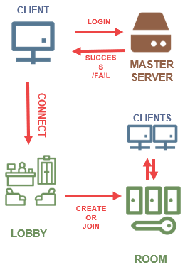
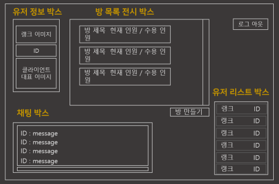

---

layout: post

title: "Dragon's Treasure"

subtitle: "Dankook Univ. 2017 Capstone Design Project"

type: "Project"

book: false

projects: true

post-header: true

portfolio: true

main-img: "img/dragon_treasure_header.png"

text: true

author: "YoSeb Choi"

header-img: "img/header.png"

portfolio: true

order: 1

---

# **2017년 단국대학교 종합설계 Project.**

프로젝트 이름 : Dragon's Treasure

프로젝트 장르 : Unity 3D 기반 멀티 액션 게임

프로젝트 기간 : 2017.08.01 ~ 2017.12.31

프로젝트 인원 : 총원 3명 (개발인원 3명)

프로젝트 요약 : 3D로 구현된 맵과 캐릭터를 통해 미로에서 탐색, 대전 등의 요소를 통해 모든 열쇠를 모아 가장 먼저 탈출한 사람이 승리하는 게임.

수행 역할 : 서버와 클라이언트의 정보전달에 대한 연결, 클라이언트 로직 구현

개발 환경 : `C#`, `Unity Engine`, `Visual Studio`

버전 관리 : `Unity Collaboration`

주요 개발 내용

- 서버에서 전송되는 패킷 정보를 클라이언트에 맞게 분배/변경
- 클라이언트의 정보를 서버에 맞게 가공 후 서버에게 전송
- 원활한 통신이 이루어질 수 있도록 서버개발자와 패킷 프로토콜 협약
- 클라이언트 개발자와 서버 개발자간에 원활한 커뮤니케이션을 위한 소통 창구 역할.

# 마스터 서버와 통신하여 클라이언트에 적용하는 업무

서버에서 보내주는 패킷을 `Header`별로 구분하고, `Success`/`Fail` 여부를 구분하여 분기처리를 통해 데이터를 출력하거나 예외처리를 진행하였습니다.

기능별로 `ClientListManager`, `ClientStateManager` 등 각각의 `Manager`에게 구분된 패킷에 담긴 정보를 전달해주어 `Manager`와 연결된 속성에게 값을 띄우도록 구현했습니다.

생애 첫 프로젝트인지라, 패킷을 분석할 때의 분기처리에 대해 깔끔하게 진행하지 못한 점이 아쉽지만, 패킷 송수신의 작동 원리를 공부해보았다는 것에 의의를 두고 있습니다.

또한 서버로부터 송신한 패킷을 분석하여 다른 유저의 정보나 채팅 등을 구별하며, 이를 출력할 UI를 직접 제작하고 해당 기능을 직접 연결하는 경험 또한 할 수 있었습니다.

