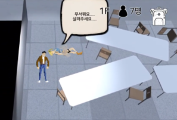
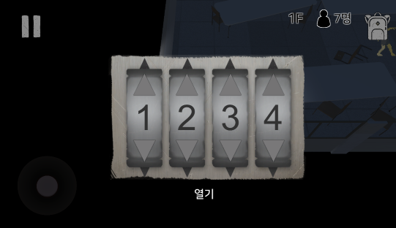

---

layout: post

title: "HereWeAre"

subtitle: "2018 Dankook Univ. & Ajou Univ. Coop Game Project"

type: "Project"

book: false

projects: true

text: true

portfolio: true

author: "YoSeb Choi"

post-header: true

header-img: "img/header.png"

main-img: "img/here-we-are-post-header.png"

order: 1

---

# **2018년 아주대학교 게임개발동아리와 협업 Project.**

프로젝트 이름 : 지금, 우리는

프로젝트 장르 : 어드벤쳐 퍼즐 모바일 게임

프로젝트 기간 : 2018.05.01 ~ 2018.12.30

프로젝트 인원 : 총원 6명 (개발인원 2명)

프로젝트 요약 : 좀비 감염이 발생한 학교에서 학생들 구출하는 역할을 맡은 선생님의 입장에서 플레이 하는 퍼즐게임.

[프로젝트 영상](https://www.youtube.com/watch?v=v-ZfY3sHq1Y)

수행 역할 : 클라이언트 로직 및 시스템 구현

개발 환경 : `C#`, `Unity Engine`, `Visual Studio`

버전 관리 : `Bitbucket`(Git), `SourceTree`

주요 개발 내용

- Dialog 시스템 구현
- 클라이언트 로직 구현
- 캐릭터 이동, 상호작용 등 이벤트들의 로직 구현
- Resources Management에 대한 로직 구현

# 상호작용이나 특정 상황 시 발생하는 이벤트 처리

주어진 개발 라이브러리를 통하여 플레이어가 특정 상호작용을 하거나, 일정 진행도를 달성했을 때 `Object Pool`에 Dialog들을 Push하여 이벤트를 연출하고, 기획된 대로의 상황을 플레이어에게 충실하게 전달하는 역할을 맡았습니다.

이벤트 로직 구현이라는 업무를 맡으면서 모델의 애니메이션이나 분기처리, 코드의 재사용 등 라이브러리와 시스템에 대한 이해, 그리고 전반적인 개발 일정 소화에 대한 것을 꾸준히 배우며 소화하려는 노력을 기울였습니다.
