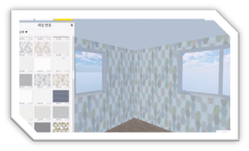

---

layout: post

title: "Manmulator"

subtitle: "ManManterior Virtual Interior Simulator"

type: "project"

book: false

projects: true

text: true

author: "YoSeb Choi"

post-header: true

portfolio: true

main-img: "img/manman_header.png"

header-img: "img/header.png"

order: 1

---

# **2019 학생 창업유망팀 300출신 스타트업 '만만테리어'의 프로젝트.**

프로젝트 이름 : ManMulator

프로젝트 장르 : 인테리어 수요층을 위한 가상 인테리어 시뮬레이터 솔루션

프로젝트 기간 : 2019.02.01 ~ 2019.06.30

프로젝트 인원 : 총원 5명 (개발인원 2명)

프로젝트 요약 : 사용자가 직접 인테리어 자재를 보고, 업체를 찾아다닐 필요 없이 시뮬레이터 솔루션을 통해 자신의 집을 직접 꾸미고, 여러가지 인테리어가 적용된 모습을 볼 수 있다.

수행 역할 : 클라이언트 로직 및 시스템 구현

개발 환경 : `C#`, `Unity Engine`, `Visual Studio`

버전 관리 : `Bitbucket`(Git), `SourceTree`

주요 개발 내용

- 프로젝트 구조 설계
- 시뮬레이터 클라이언트의 핵심 로직 구현

# **ManMulator**

2019년 2월부터 6월까지 진행했던 프로젝트로, Unity 3D를 이용한 일반 소비자를 위한 인테리어 시뮬레이터입니다.

스타트업 기업인 '만만테리어'에서 [개발 플레이어]직으로 단국대학교 LINK+ 사업단과 연계하여 인턴 협약을 맺고 시뮬레이터 클라이언트 개발을 맡았습니다.

# MVP Model 채택 & 구현

해당 프로젝트의 프로토타입을 제작해본 후, Re-Building 하는 과정에서 프로젝트의 모델에 대한 고민을 하다가 웹에서 사용되고 있는 `MVC모델`과 비슷한 `MVP모델`이 저희의 프로젝트와 시너지가 좋을 것 같아 고려하게 되었습니다.

MVP모델에서 유니티 엔진은 자체적으로 `View`역할을 맡게 되며, 프로젝트의 데이터를 담당할 Model을 완전히 분리하여 두고, 사용자의 Input에 대응하여 실행하는 `Presenter`들을 분리하여 로직을 관리하기 간편하게 정리하였습니다.

MVP를 채택함으로써 오는 장점으로는 로직과 데이터를 분리해서 관리할 수 있다는 것이었지만, Presenter에 로직이 모여 있다 보니 코드의 가독성이 떨어진다는 문제점이 있어 `Partial Class`와 `UniRx`등의 사용으로 해당 문제를 해결하려고 노력하였습니다.

# 이전에 없던 솔루션, 이제는 있어야 할 로직

해당 프로젝트는 ‘사용자가 자신의 집을 손쉽게 재현해낼 수 있어야 한다’는 미션을 가지고 있었는데, 집을 ‘방’ 단위로 분해하여 한 단계씩 붙여 나간다면 직관적으로 자신의 집을 도면화 시킬 수 있다고 생각했지만, 이를 그대로 구현하기에는 많은 어려움이 따랐습니다.

여러 직사각형이 겹쳐져 하나의 ‘방’을 만들기 위해서는 해당 상황에 따른 로직이 필요했고, 저는 나름대로 혼자만의 연구를 통해 사각형의 외곽점과 교차점에 서로 다른 방향성을 부여하여 일관적으로 다른 직사각형들을 같은 방이라고 인식하는 것에 성공했습니다.

C#의 `List`와 `Linq`, `Dictionary`를 적절히 이용하여 로직을 구현하였고, 해당 로직이 정상적으로 돌아가기 위해 수 많은 예외들에게 구타를 맞고 나서야 그나마 돌아가는 수준으로 끌어올릴 수 있었습니다.

이후에도 해당 프로젝트에서 오브젝트끼리 자석 기능과 `2D`->`3D`좌표계의 변환을 통한 모델 오브젝트 생성, 주로 사용자 친화적인 UI/UX구성 + 편리한 조작감에 중점을 두고 개발을 진행하였습니다.
